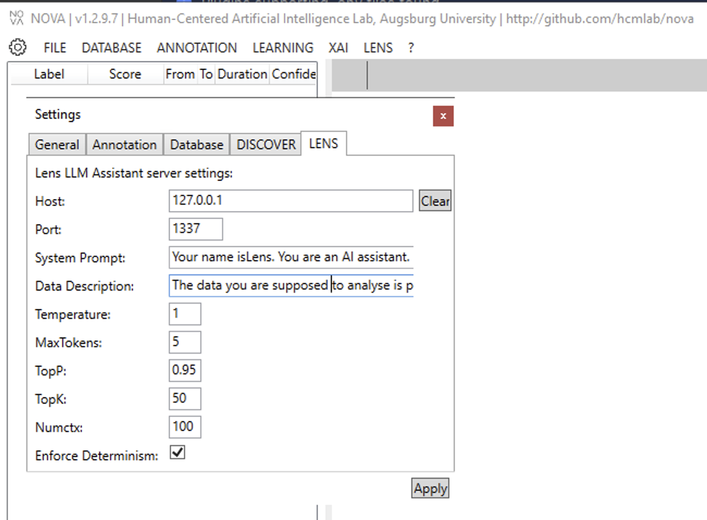

# LENS: Learning and Exploring through Natural language Systems

LENS is lightweight webserver designed to use Large Language Models as tool for data exploration in human interactions.
In this tutorial we show how LENS can be used in conjunction to with the [NOVA](https://github.com/hcmlab/nova) user interface and the [DISCOVER](https://github.com/hcmlab/discover) server to explore and categorize textual data.

## Overview

First let's make sure to establish a common understanding of the interplay between NOVA, DISCOVER and LENS.
NOVA is the user interface to interact with all other services. While NOVA can be used as a standalone tool to visualize and annotated multimodal data streams it also has the built-in ability to communicate with LENS and DISCOVER servers using their respective apis.

DISCOVER serves as a computational backend to extract features or infer annotations from multimodal data using predefined modules. For example such modules can be used to detect faces in images or create a transcript from an audio signal.
Since modules all need to implement a common interface, it is straight forward to write your own modules and provide them to others. All modules are producing either annotations or datastreams that can be later visualized in the NOVA user interface.
DISCOVER also works in tandem together with the NOVA annotation database. Annotations can therefore be directly written to or read from this database to enable coherent data management and easy sharing of results among all database users.

LENS is lightweight webserver that provides a unified API to contact multiple LLMs using the same request format. This includes local instances such as [Ollama](https://ollama.com) or webservices such as [ChatGPT](https://chatgpt.com). 
This api is also integrated in the NOVA user interface to enable a seamless interaction with text annotations from within NOVA.

In the following we will demonstrate the interaction between those three tools using three exemplary use cases. 

## Prerequisites

For all the following use cases we assume that you already have NOVA, DISCOVER and LENS installed.
Refer to the following documentations if this is not the case: 
* [NOVA Documentation](https://rawgit.com/hcmlab/nova/master/docs/index.html)
* [DISCOVER Documentation](https://hcmlab.github.io/discover/tutorials/introduction.html#getting-started)
* [LENS Documentation](https://github.com/hcmlab/lens)

Once the three services are up and running we first need to connect NOVA to DISCOVER and LENS. 
To this end open NOVA and click on the gear icon in the top left corner. 
In the settings menu you should see two tabs DISCOVER and LENS.

